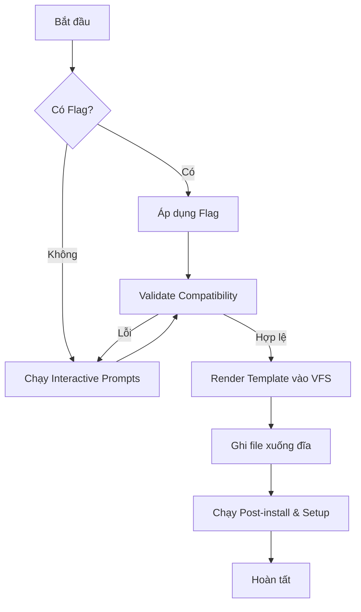

# CLI Workflow (Quy trình hoạt động)

Quy trình khởi tạo một dự án mới (`create`) đi qua các giai đoạn nghiêm ngặt để đảm bảo tính đúng đắn và trải nghiệm người dùng tốt nhất.

## Luồng thực thi chính

Dưới đây là các bước mà `createProjectHandler` thực hiện khi được gọi:

### 1. Phân tích đầu vào (Input Parsing)
CLI nhận input từ hai nguồn chính:
- **CLI Flags**: Các tham số người dùng gõ trực tiếp (ví dụ: `--database postgres --orm drizzle`).
- **Templates**: Nếu người dùng chọn một template có sẵn (qua flag `--template`), các cấu hình mặc định của template đó sẽ được áp dụng.

### 2. Xác định tên dự án và thư mục
- Nếu không có tên dự án, CLI sẽ hỏi người dùng.
- Kiểm tra xung đột thư mục (Directory Conflict). CLI hỗ trợ các chiến lược: `overwrite` (ghi đè), `merge` (gộp), `increment` (tăng số thứ tự tên thư mục), hoặc `error` (dừng lại).

### 3. Thu thập cấu hình (Configuration Gathering)
Ở bước này, CLI xác định những flag nào còn thiếu.
- **Chế độ tương tác**: Nếu thiếu flag và không chạy với flag `--yes`, hệ thống `navigable-prompts` sẽ kích hoạt để hỏi người dùng.
- **Chế độ không tương tác**: Sử dụng giá trị mặc định cho các phần còn thiếu.

### 4. Kiểm tra tính tương thích (Compatibility Check)
Đây là bước cực kỳ quan trọng. CLI sử dụng `src/utils/config-validation.ts` để kiểm tra các ràng buộc:
- Ví dụ: Nếu chọn ORM là `Mongoose` nhưng database lại là `Postgres`, CLI sẽ báo lỗi ngay lập tức và yêu cầu chọn lại.
- Hệ thống validation sử dụng `better-result` để trả về lỗi chi tiết thay vì crash chương trình.

### 5. Khởi tạo File System ảo (Virtual File System - VFS)
CLI không ghi file trực tiếp xuống đĩa ngay từ đầu. Thay vào đó:
- Nó tạo ra một `VirtualFileSystem` trong bộ nhớ.
- Gọi `@better-t-stack/template-generator` để render các file từ template Handlebars vào VFS này.

### 6. Ghi xuống đĩa (Physical Writing)
Sau khi VFS đã sẵn sàng và được kiểm tra:
- Toàn bộ cây thư mục được ghi xuống ổ cứng của người dùng thông qua `writeTree`.
- Nếu có lỗi trong quá trình ghi (ví dụ: thiếu quyền), CLI sẽ rollback hoặc báo lỗi cụ thể.

### 7. Hậu xử lý (Post-Processing)
Sau khi file đã được ghi thành công:
- Khởi tạo Git repository (nếu yêu cầu).
- Cài đặt dependency thông qua package manager đã chọn (npm, bun, vv...).
- Thực hiện Database Setup (nếu người dùng chọn các dịch vụ cloud như Neon/Turso, CLI sẽ hướng dẫn hoặc tự động kết nối API).
- Lưu thông tin vào lịch sử local (`history.json`).

## Sơ đồ tóm tắt

